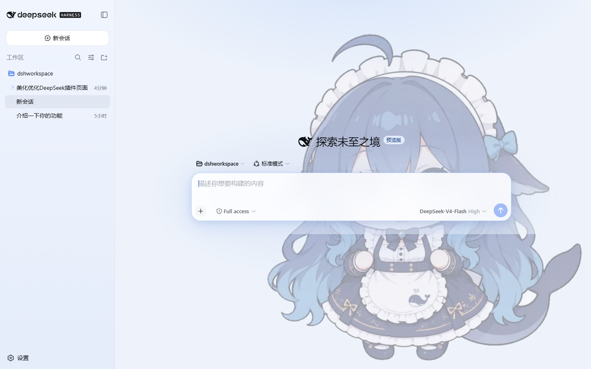
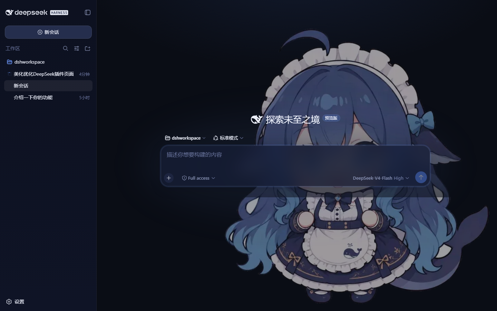

# dsh-ui-crystal 馃悑馃拵

> Crystal 鈥?a polished blue-violet UI theme for the **DeepSeek Harness** web shell, featuring the DeepSeek **椴搁奔濞?(whale-girl)** as a seamless background companion.
>
> 涓?DeepSeek Harness 缃戦〉绔墦閫犵殑姘存櫠涓婚锛氭繁钃濈传閰嶈壊 + 椴搁奔濞樼珛缁樿儗鏅紝绾?CSS 瀹㈡埛绔彃浠讹紝鏃犻渶鏋勫缓銆侀浂渚濊禆銆佸嵆鎻掑嵆鐢ㄣ€?



## Features / 鐗规€?
| Area | Effect |
|---|---|
| Dark palette | Deep blue-violet scale replaces the stock gray-blue; vivid DeepSeek-blue accent |
| Light palette | Airy blue-tinted white, refined shadows |
| Brand / buttons | Blue 鈫?violet gradient primary fill, matching hover states |
| Composer | Glassy translucent input card with backdrop blur and a focus glow |
| Conversation | Soft ambient glow behind the chat column |
| Scrollbars | Blue-violet floating pill thumb (WebKit) + tinted Firefox thumb |
| Background | 椴搁奔濞?transparent PNG embedded as WebP (40% alpha light / 60% dark), zero-scrim, seamless |
| **Background switcher** | 馃帹 宸︿笅瑙掑垏鎹㈡寜閽細27 寮犲唴缃绾?+ **鏈湴鍥剧墖涓婁紶**锛坈anvas 鍘嬬缉鍚庢寔涔呭寲锛? **閫忔槑搴︽粦鍧?* + localStorage 璁板繂 |
| Typography | Nicer UI / code font stacks (full CJK fallbacks) |

### Background switcher / 鑳屾櫙鍒囨崲

- 鐐瑰嚮宸︿笅瑙?**馃帹** 鎸夐挳鎵撳紑闈㈡澘锛氬唴缃儗鏅缉鐣ュ浘銆侌煇?椴搁奔濞樸€佹棤鑳屾櫙銆侌煋?鏈湴鍥剧墖銆侀€忔槑搴︽粦鍧?- **灞曠ず鏂瑰紡**锛氬唴缃浘鐗囧浐瀹氬彸涓嬭鑷劧澶у皬锛?*鐢ㄦ埛涓婁紶鐨勫浘鐗囧彲閫?瑙掕惤 / 鍏ㄥ睆"**锛堝叏灞?= cover 鎷変几锛?- **娣诲姞鑷繁鐨勮儗鏅?*锛氭妸鍥剧墖锛坧ng/jpg/webp/gif锛変涪杩涙彃浠剁洰褰?`assets/backgrounds/`锛屽埛鏂板悗鑷姩鍑虹幇鍦ㄥ垪琛紙鐢辨彃浠?Node 绔己鏈嶏紝鏃犻渶閲嶆柊鏋勫缓锛夈€傚唴缃浘鐗囧凡鍋?*鐧藉簳杞€忔槑**澶勭悊锛坄node make-transparent.mjs` 鍙鏂板鐧藉簳鍥鹃噸澶嶆墽琛岋級
- 鏈湴鍥剧墖涓婁紶浼氬厛鍘嬬缉锛堟渶闀胯竟 1920px锛夊啀瀛樺叆 localStorage锛涢€夋嫨銆佸睍绀烘柟寮忎笌閫忔槑搴﹀埛鏂板悗淇濈暀

## How it works / 鍘熺悊

A pure-CSS **client plugin** in the DSH sense: the package declares
`dsh.client` and exposes a `./client` bundle that the web shell materializes.
Materializing injects one `<style>` tag that overrides the harness's
`--dsw-*` design tokens plus a few stable attribute-hooked surfaces. No server
logic, no dependencies, no build step for consumers.

## Install / 瀹夎锛堝畼鏂?bundle 鏍煎紡锛屼竴琛岄儴缃诧級

> 馃摉 瀹屾暣閮ㄧ讲鏂囨。瑙?**[DEPLOY.md](DEPLOY.md)**锛堜竴閿剼鏈€佷竴琛屽懡浠ゃ€侀獙璇併€佹晠闅滄帓鏌ャ€佸嵏杞斤級銆?
**涓€閿儴缃诧紙鎺ㄨ崘锛夛細**

```sh
cd dsh-ui-crystal
node deploy.js        # 瀹樻柟 dsh plugin 娴佺▼ + bundle 鑷姩婵€娲?+ 鏍￠獙
dsh web               # 閲嶅惎涓€娆?```

**绾懡浠や竴琛岄儴缃?*锛堝彂甯冨埌 GitHub 鍚庯紝鎴栨湰鍦拌矾寰勶級锛?
```sh
dsh plugin --profile web add "github:<浣犵殑鐢ㄦ埛鍚?/dsh-ui-crystal#main"
dsh web
```

鏈寘澹版槑 `dsh.bundle.patch`锛坄cordis.patch.yml`锛夛紝鍥犳 `dsh plugin add` 浼?**鑷姩**鎶婂畠鍔犲叆 `dsh.profile.bundles`锛屽惎鍔ㄦ椂鑷姩鎻掑叆 loader 琛屸€斺€?*鏃犻渶鎵嬪姩
缂栬緫浠讳綍 profile 鏂囦欢**銆備箣鍚庣紪杈?`client.js` 缁?client-hmr 鐑洿鏂帮紝鏃犻渶閲嶅惎銆?
### Uninstall / 鍗歌浇

```sh
dsh plugin --profile web remove dsh-ui-crystal
dsh web
```

## Develop / 寮€鍙?
The theme's readable source lives in `src/styles.css`; the whale art in
`assets/`. `client.js` is a **generated artifact** 鈥?rebuild it after changes:

```sh
node build.js          # src/styles.css + assets/*.webp -> client.js
```

### Customize the whale / 鑷畾涔夐哺楸?
| Want | Where |
|---|---|
| Bigger / smaller | `background-size: auto 92vh` in `src/styles.css` |
| Stronger / fainter | regenerate `assets/whale-light.webp` (40% alpha) / `assets/whale-dark.webp` (60%) |
| Different art | swap the WebP files (keep transparency), then `node build.js` |
| Reposition | `background-position: calc(100% - 6px) 100%` |

To regenerate the alpha variants from a source PNG with
[sharp](https://sharp.pixelplumbing.com/):

```js
// multiply the alpha channel, e.g. 0.4 for light / 0.6 for dark, then
// .webp({ quality: 82 }) and save into assets/
```

## License / 璁稿彲

- **Code** (CSS, build scripts, manifests): [MIT](LICENSE)
- **Artwork** (whale-girl images): **CC BY-NC-SA 4.0** 鈥?see [ASSET_LICENSE.md](ASSET_LICENSE.md)
  - Source: [fornarwhal/deepseek-whale-girl-icon](https://github.com/fornarwhal/deepseek-whale-girl-icon)
  - 瑙掕壊銆屾簾鏈堛€峛y 涓婂杽鏃犲舰 路 浜屽垱 by ZipZipPipe 路 淇 by QYQCAMIAO

## Credits / 鑷磋阿

- [DeepSeek Harness](https://github.com/deepseek-ai/deepseek-harness) 鈥?the host app this theme plugs into
- 椴搁奔濞樼礌鏉愪粨搴撲綔鑰?for the artwork
